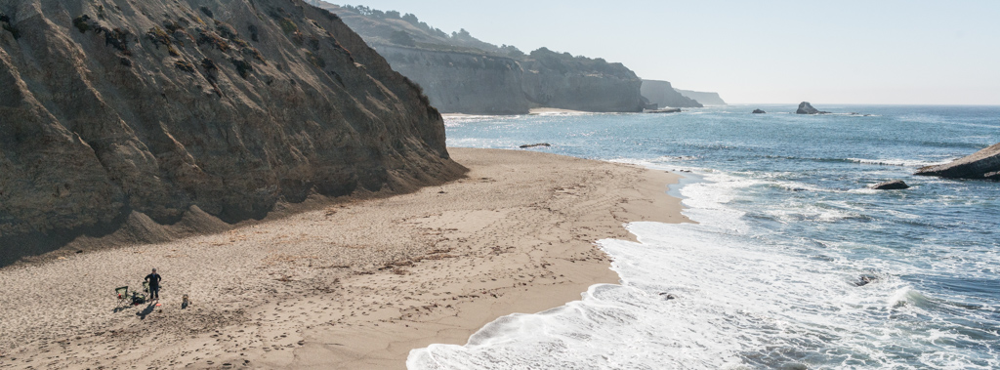
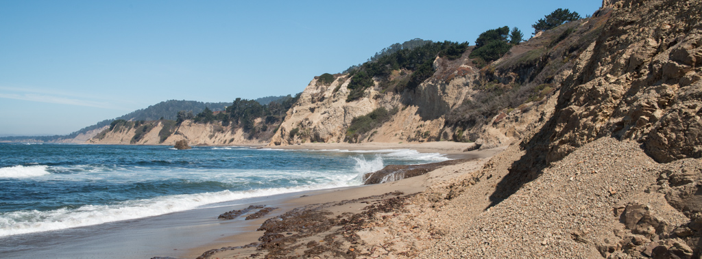
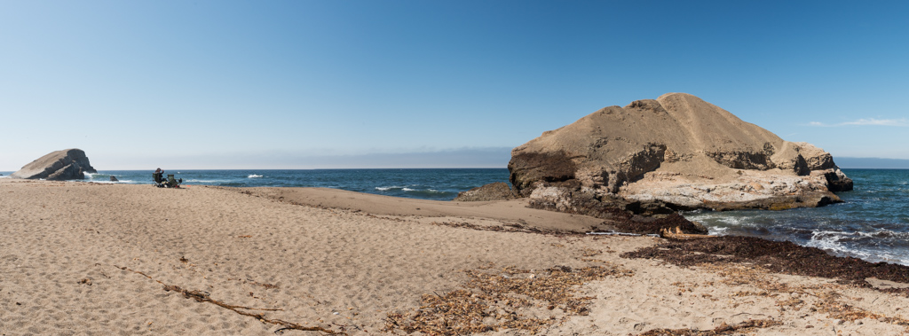

# {{ page.title }}

 
 
 

Features: a very wide beach below cliffs.  The trail is paved, through steep 
at times. There is a vault toilet in the parking lot.  The beach has rather [large
sand](grb-sand-01.jpg), which is nice for keeping it out of your shoes.

September 17, 2016
