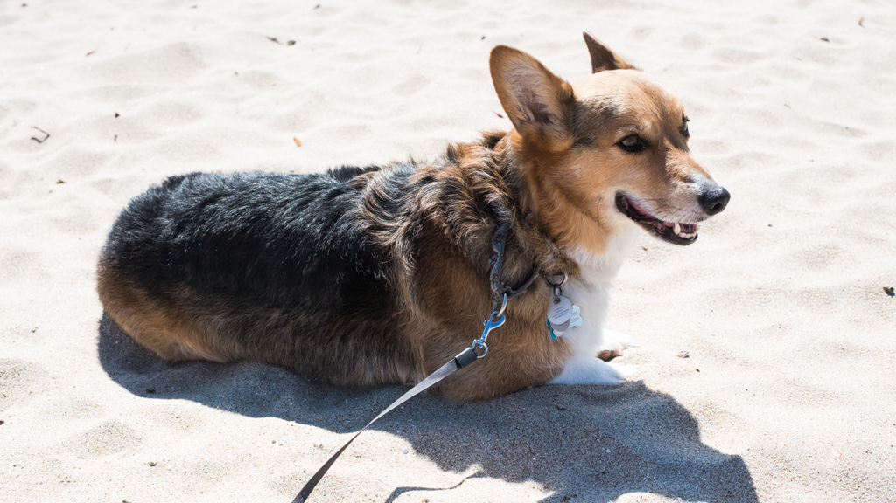

# {{ page.title }}

See also [California parks](california_parks.html).

Beaches are organized north to south.

Bold red No Dogs indicates that the location is not dog friendly.

* Marin County
  * Dillon beach, p. 24, p. 103
  * Lawson's landing, p. 24, p. 103 
  * Chicken Ranch beach, p. 109 
  * Kehoe beach, p. 45, p. 111 , <i>restricted dogs</i> during snowy plover nesting season, mid-March to early September.
  * North beach and South beach, p. 46, p. 111 , <i>restricted dogs</i>, as above
  * Limantour beach, p. 55, p. 113 
  * Olema, p. 57, p. 113 
  * Bolinas beach, p. 115 
* San Francisco County
  * Presidio of San Francisco, p. 133
  * Crissy Field beach, p. 133
  * Baker beach, p. 133
  * Golden Gate park, p. 135
  * [Ocean Beach](ca/ocean_beach/), p. 114 
    Also hosts the California Corgi-Con twice a year.
  * Lake Merced, p. 135
  * Fort Funston, p. 135
* San Mateo County
  * Thornton beach vista (no beach access), p. 143 
  * Mussel Rock city park, p. 143 
  * [Pacific Manor beach](ca/pacific_manor/) (alt. <i>Esplanade beach</i>), p. 143, off leash OK
  * Sharp park beach, p. 143 
  * Beachfront path, p. 143 
  * Milagra Ridge, p. 143, <i>some dog restrictions</i>
  * Mori Point, p. 127, p. 145  
    Dogs only allowed on trail to Mori point.  Observe signed restrictions.
  * Sweeney Ridge trail, p. 128, p. 145  
    Observe signed restrictions on trails.
  * Montara state beach, p. 135, p. 147 
  * Coastside trail, p. 149
  * El Granada / Surfer's beach, p. 149
  * Blufftop Coastal Park, p. 140, p. 149
  * Pebble Beach, p. 148, p. 153
  * [Bean Hollow state beach](ca/bean_hollow/), p. 149, p. 153
* Santa Cruz County
  * Greyhound rock access, p. 159, p. 163
  * Davenport landing beach, p. ???, p. 163
  * [Natural bridges state beach](ca/natural_bridges/), p. 169, [map](https://www.google.com/maps/@36.9704969,-122.1169129,5374m/data=!3m1!1e3), No Dogs 
    Either 3 mile or 4 mile beach, not sure which, p. 165
  * Henry Cowell Redwoods state park, p. 169
  * Mitchell’s cove beach, p. 170
  * [Lighthouse field state beach](ca/light_house_sc/), p. 170, p. 167 [map](https://www.google.com/maps/@36.9520558,-122.0269861,675m/data=!3m1!1e3)
  * Seabright beach, p. 169
  * Frederick street beach, p. 169
  * Santa Cruz harbor north and south, p. 180
  * Harbor beach, p. 181, p. 169
  * Twin lakes state beach-east, p. 183, p. 171
  * New Brighton state beach, p. 193, p. 173
  * Hidden beach county park, p. 196, p. 175
  * Seascape beach and county park, p. 196, p. 175
  * Manresa state beach, p. 199, p. 177
* Monterey County
  * Marina dunes open space preserve, p. 219, p. 187
  * Eolian Dunes preserve, p. 187
  * Fort Ord National Monument, p. 187
  * Del Monte Beach, p. 189
  * Monterey Bay Sanctuary Scenic Trail, p. 191
  * El Estero Park, p. 191
  * Monterey Beach, p. 191
  * Asilomar state beach, p. 247
  * Del Monte forest hiking and equestrian trails, p. 197
  * Lynn "Rip" Van Winkle open space, p. 247
  * [17-mile drive](ca/17_mile/), requires entry fee
  * Carmel city beach, p. 257, p. 199
  * Carmel river state beach, p. 199 (to verify)
  * Point Lobos state natural reserve, p. 259, No Dogs
  * Garrapata beach, p. 268, p. 201
  * Bottcher's gap, p. 201 (day use area)
  * Riverside campground (private), p. 277, p. 203
  * Pfeiffer Beach, p. 279, p. 205, [USFS](http://www.fs.usda.gov/recarea/lpnf/recarea/?recid=10918)
  * Los Padres National Forest, p. 205 (1,200 miles of trails)
  * Blufftop paths, p. 209
  * Sand Dollar beach, p. 209
  * Cruickshank trail, p. 209
  * Salmon Creek trail, p. 209

Blue page numbers: “Beaches and parks from San Francisco to Monterey” by the California Coastal Commission, 2012 ([Amazon](https://www.google.com/url?q=https://www.amazon.com/Beaches-Parks-San-Francisco-Monterey/dp/0520271572/ref%3Dsr_1_1?ie%3DUTF8%26qid%3D1469980810%26sr%3D8-1%26keywords%3Dbeaches%2Band%2Bparks%2Bfrom%2Bsan%2Bfrancisco%2Bto%2Bmonterey&sa=D&ust=1469986799460000&usg=AFQjCNHtKoE4iEpxkr5VazokMmIMazq93w))

Orange page numbers: “California coastal access guide” by the California Coastal Commission, 2014, Seventh edition ([Amazon](https://www.google.com/url?q=https://www.amazon.com/California-Coastal-Access-Guide-Commis/dp/0520278178/ref%3Dpd_sim_14_4?ie%3DUTF8%26dpID%3D51-vX3cfwDL%26dpSrc%3Dsims%26preST%3D_AC_UL160_SR112%252C160_%26psc%3D1%26refRID%3DKD0G4GTKDAY687WEZDEE&sa=D&ust=1469986799463000&usg=AFQjCNHVAJvRplsz5G9YHo27opdTI6Tqnw))

